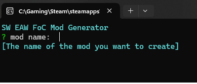

# EAWFOC Mod Generator

A Rust-based CLI scaffolding tool for generating a new mod project for Star Wars: Empire At War: Forces of Corruption

## Getting Started

>Note: MacOS is not supported, Linux support is WIP

### Usage
Download release from Github Releases. This tool does not require installation.

It is recommended to run this tool in the local mods folder.

```
  Steam: ...\Star Wars: Empire at War\corruption\Mods\
```

Run the following command (Windows)
```shell
.\eawfoc_mod_generator.exe
```
or double-click on the executable

Running the program should display this prompt:


### Build and Develop Locally

Install [Rust]([https://www.rust-lang.org/tools/install) Using rustup (Recommended)
- To start using Rust, download the installer, then run the program and follow the onscreen instructions. You may need to install the Visual Studio C++ Build tools when prompted to do so. If you are not on Windows see "Other Installation Methods".

Clone the project using Git
```shell
  git clone https://github.com/sanick2/eawfoc_mod_generator.git
```

or using GitHub CLI
```shell
  gh repo clone sanick2/eawfoc_mod_generator
```

Go to the project directory

```shell
  cd eawfoc_mod_generator
```

Install dependencies

```shell
  cargo build
```

Start the CLI

```shell
  cargo run
```


## License

This project is licensed under the [MIT](https://mit-license.org/) License - see the LICENSE.md file for details

